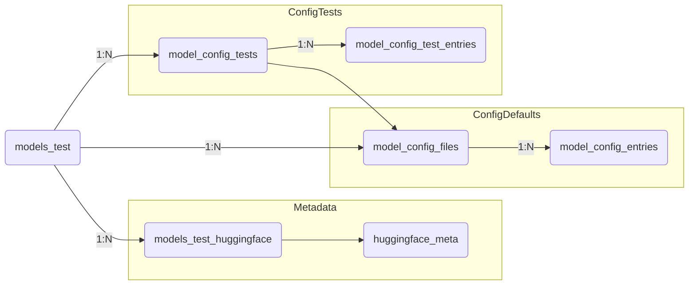

# Vector-Tester – Model Test Staging & Configuration Workflow

This document explains how Vector-Tester persists staged model metadata/configs and how to use those records to prepare alternate configurations for compatibility and performance testing.

---

## 1. Data Model Overview

### 1.1 models_test
- Represents each staged model copied from the primary registry.
- Key columns: `model_name`, `hf_path`, `cache_location`, `metadata` (JSON snapshot from the main registry), `status`, `cached_at`.
- Acts as the root foreign key for all staging artifacts in Vector-Tester.

### 1.2 models_test_huggingface & huggingface_meta
- `huggingface_meta` keeps a normalized catalog of every metadata element seen while scraping a HuggingFace model card (YAML front-matter + Markdown sections). Each canonical path is stored once with `element_type`, `category`, `semantic_role`, inclusion flags (`active`, `detailed`, `extensive`), and sample values.
- `models_test_huggingface` links those catalog entries back to a specific `models_test` row. It stores the concrete value, card location, and timestamps (`detected_at`, `created_at`, `updated_at`). Pruning ensures inactive catalog entries disappear from snapshots.
- Purpose: capture licensing, parameters (e.g., `inference.parameters.temperature`), localization tags, safety statements, etc., at staging time so compatibility issues can be identified before test runs.

### 1.3 model_config_files & model_config_entries
- When you trigger “Sync config.json” or “Sync generation_config”, the raw file is downloaded from HuggingFace and stored in `model_config_files` (one row per `config_type` and `model_test_id`, includes `sha256`, `content`, `source_url`, `parsed_at`).
- The JSON is flattened and persisted in `model_config_entries`, one row per JSON path. Each entry keeps the text/JSON value, inferred data type, and optional link back to `model_parameters`. These rows represent the default configuration shipped with the model.

### 1.4 model_config_tests & model_config_test_entries
- Config tests represent alternate configuration bundles derived from the defaults. Each `model_config_tests` row references the base default file, tracks metadata (`name`, `description`, `load_status`, `load_notes`, `last_tested_at`), and inherits the flattened tree at creation time.
- `model_config_test_entries` mirror `model_config_entries` but add two important flags:
  * `active` – whether this parameter should appear in the generated config.
  * `inherit_default` – whether it should use the default value (`value_text/value_json` are ignored if true).
- These rows carry the same timestamps as metadata entries so you can audit when values changed.

### 1.5 CLI & APIs
- All tables above are exposed via backend helpers and thin Next.js API routes:
  * `/api/models/huggingface` – metadata sync.
  * `/api/models/configs/:model_test_id` – list default config files/entries.
  * `/api/models/huggingface/config` – config sync.
  * `/api/models/config-tests*` – CRUD operations for config tests and entries.
- `scripts/config_test_cli.py` gives a scriptable interface for listing config tests and toggling entries from the command line.

---

## 2. Optimal Workflow for Managing Model Tests

### Step 1 – Stage the model
1. In the Registry tab, choose a model and click **Stage Test**. This copies the current registry record into `models_test`.
2. Optionally use **Model Details** to verify metadata such as `hf_path`, compatibility notes, etc.

### Step 2 – Capture metadata and defaults
1. Click **Sync Basic Metadata** (or Detailed/Extensive) to populate `models_test_huggingface`. This helps auditors spot licensing/responsible-use problems early.
2. Click **Sync config.json / generation_config** to populate `model_config_files` and `model_config_entries`. Any future deltas are tracked by hash.
3. Use **View Metadata** and **View Config Defaults** from the staged model list to confirm capture.

### Step 3 – Build config tests per staged model
1. Click **Config Builder** next to a staged model. This opens a modal with tabs for `config.json` and `generation_config`.
2. If no tests exist for that file, Vector-Tester auto-creates `CFG00x <Model Name>` using the default tree as a starting point. Quick “+ config.json” buttons let you create dedicated configs for each file in one click.
3. Each tab lists existing config tests; choose one and click **Edit** to open the test editor modal, or keep working in the builder modal to manage the list.

### Step 4 – Edit entries
1. The test editor shows three controls per entry:
   * **Active** checkbox – include/exclude this key from the generated JSON.
   * **Use default** checkbox – inherit the default value recorded in `model_config_entries`.
   * **Value editor** – when “Use default” is off, edit the custom override in place.
2. The UI always displays the captured default beneath the field, making it easy to revert.
3. Clicking **Save** writes the override without changing the “Use default” flag unless you explicitly uncheck it.
4. Clicking **Restore** re-applies the default and re-enables inheritance in one action.
5. Use the “Add Custom Entry” form to introduce paths that weren’t part of the original JSON (e.g., to set new features supported by the model version).

### Step 5 – Track testing results
1. In the config test list, update `load_status`, `load_notes`, and `last_tested_at` as you run experiments. This helps correlate failures with specific configurations.
2. The CLI can set values or toggle inclusion before running scripted test suites, ensuring the staged configs match the automation harness.

### Step 6 – Analyze compatibility issues
1. HuggingFace metadata (licensing, parameters, hardware notes) is stored alongside configs, making it easy to identify probable incompatibilities:
   * Example: `inference.parameters.max_position_embeddings` + GPU memory constraints.
   * Example: Markdown sections describing required transformer kernels for specific hardware.
2. Combine metadata insights with config overrides to plan targeted test runs for alternate environments (NVIDIA vs AMD vs CPU-only).

---

## 3. Tips & Conventions
- **Naming** – Config tests default to `CFG### <Model Name>` but you can override the name and add descriptions to capture the intent (e.g., “CFG003 GPTQ + Low VRAM”).
- **Detail levels** – Metadata is tagged as active/basic/detailed/extensive. When running the metadata sync in “Detailed” or “Extensive” mode, those additional fields are included in `models_test_huggingface`, allowing deeper audits without bloating the default view.
- **Pruning** – Both metadata sync and config sync remove rows for inactive catalog entries or stale config paths, keeping staged data clean.
- **CLI Automation** – Use `scripts/config_test_cli.py list --model-test-id <id>` to inspect configs from CI/CD, then `set --test-id <id> --path foo.bar --value 123` or `set --inherit true` to batch-update entries before launching load tests.

---

This workflow keeps staging artifacts tightly linked to `models_test`, so every compatibility investigation has a reproducible metadata/config snapshot. As we extend Vector-Tester, this document will grow to include testing orchestration steps, result logging, and hardware-specific triage processes.

---

## 4. Orchestration & Test Execution

Once a staged model has metadata and one or more configuration bundles, the next step is to run deterministic tests to validate loading, inference, and performance telemetry. The workflow below ties the configuration artifacts back into the existing runner UI/API.

### 4.1 Preparation
1. **Choose the active config test** – from the Configuration Builder modal, mark which config test you intend to run, set its `load_status` to `pending`, and document any expectations in `load_notes`.
2. **Export overrides** – the backend exposes config tests via `/api/models/config-tests/:model_test_id`; the CLI can dump each test as JSON and feed it into automation pipelines (e.g., mounting as `config.json` before starting `llm-server`).
3. **Stage server environments** – `server_environments` describes the hardware/OS. Ensure the environment that matches your compatibility goal is defined and linked to a `test_profile`.

### 4.2 Running Manual Tests (UI)
1. Navigate to **Test Runner** and select the staged model in the “Load Model” section. The runner uses the model name to resolve the corresponding `models_test` record.
2. Before clicking **Load Selected Model**, ensure the intended config overrides are applied on the target environment (either via CLI or by updating the deployment’s config files). Vector-Tester doesn’t push configs automatically yet; instead it tracks them so you can audit what was used.
3. After a load attempt, capture the result:
   * Update the config test’s `load_status` (success/failed/pending) and `load_notes` from the Configuration Builder modal.
   * Use **Log Manual Test Attempt** to record scenario, notes, and reference the config test name in the notes field so results are traceable.

### 4.3 Automated / Scripted Runs
1. Use `scripts/config_test_cli.py list --model-test-id <id>` to fetch configs, then generate the actual `config.json` a scripted test harness needs.
2. Run the test suite against each config test, capturing logs via `/api/log-events` (Vector-Tester can ingest logs even if the main API restarts).
3. After each run, call `/api/models/config-tests/test` (or use the CLI) to set `load_status=success/failed`, attach `load_notes`, and set `last_tested_at`. This keeps a machine-readable history of configurations vs. outcomes.

### 4.4 Linking Results
1. Each `test_run` record references the model name; include the config test name in the `scenario` or `notes` to correlate results manually.
2. For deeper automation, consider extending `test_profiles` to include a `config_test_id` so orchestrated runs automatically log which config bundle was active. (Design placeholder.)

### 4.5 Troubleshooting Compatibility
1. Compare the HuggingFace metadata (e.g., `inference.parameters.*`, Markdown sections on “Hardware requirements”) with the config overrides. If a run fails, look for mismatches such as:
   * Attempting to enable FlashAttention on hardware that’s known to be unsupported.
   * Setting `rope_scaling.type=linear` when the metadata indicates only `dynamic` is available.
2. Record findings in `load_notes` for each config test and capture a log event to maintain auditability.

---

## 5. Future Enhancements (Roadmap)

- Automated syncing of config tests into running containers (mounting files or pushing via API) so manual steps disappear.
- Linking `test_runs` directly to `model_config_tests` for richer analytics.
- Surfacing compatibility insights (from metadata) inside the builder UI (e.g., warnings when toggling flags that conflict with captured documentation).
- Bulk exporters to snapshot all staged configs/metadata for offline review or regulatory submissions.

---

## 6. Visual Diagrams

### 6.1 Data Model Overview


### 6.2 Workflow
```mermaid
flowchart TD
    stage[Stage model\n(models_test)] --> meta[Sync HF metadata\n(models_test_huggingface)]
    stage --> cfgdefault[Sync configs\n(model_config_files + entries)]
    cfgdefault --> builder[Create config tests\n(model_config_tests + entries)]
    meta --> review[Review eligibility & warnings]
    builder --> runtests[Run tests (UI or CLI)]
    runtests --> log[Test results + load status]
    log --> iterate[Adjust configs / metadata findings]
    iterate --> builder
```
